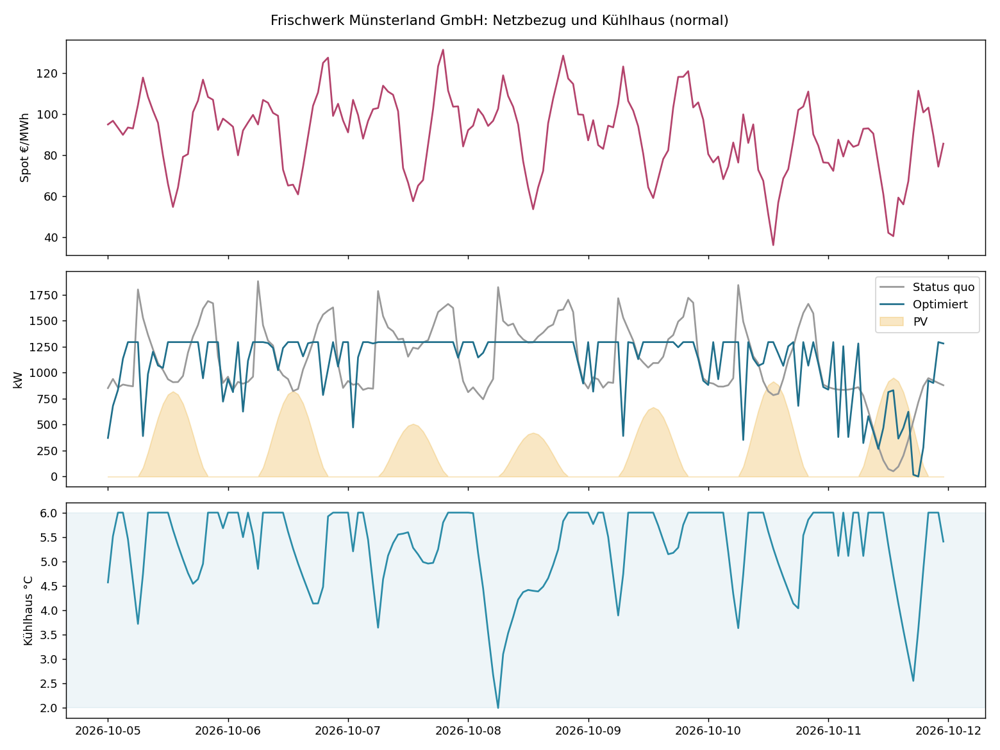
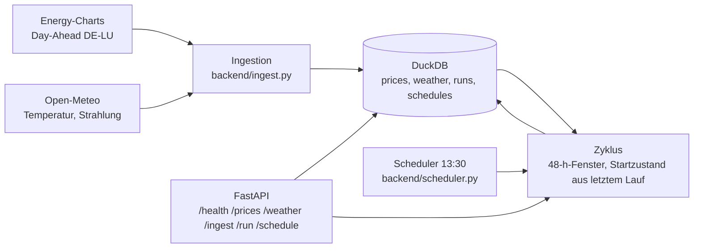

# Energiesystem-Zwilling: Industriestandort mit Kühlhaus


**Live-Demo:** <https://jonathankuhn11-spec.github.io/energy-system-twin/>

Digitaler Zwilling eines fiktiven Industriestandorts (Molkerei mit Kühllager, rund 11,8 GWh Strom pro Jahr).
Das Modell bildet Prozesslast, Kälteanlage mit dem Kühlhaus als thermischem Speicher, PV-Dachanlage und
optionalen Batteriespeicher ab und optimiert den Einsatz als lineares Programm. Dazu kommt ein
Datenqualitätsmodul, das einen RLM-Lastgang vor der Kalibrierung bereinigt: Lücken füllen, Wandlersprung
per Change-Point-Erkennung korrigieren.

**Stack:** Python, SciPy (HiGHS), NumPy, pandas, Matplotlib · Web-Demo in HTML/JavaScript mit Chart.js ·
Plattform mit FastAPI, DuckDB, Docker, Energy-Charts und Open-Meteo ·
**Status:** Modell, Optimierung, Kalibrierung, Prognoseunsicherheit, Datenqualität, Demo und Plattform-Variante stehen

## Ergebnis

Eine repräsentative Woche, hochgerechnet auf das Jahr (Arbeitskosten × 52, Leistungspreis 120 €/kW·a auf die Wochenspitze):

| Szenario | Lastspitze | Einsparung p. a. |
| --- | --- | --- |
| A Status quo: Thermostat 4 °C, kein Speicher | 1.879 kW | – |
| B Vorkühlung im Band 2–6 °C | 1.355 kW | 106 k€ |
| C Vorkühlung + Batterie 1.000 kWh | 1.293 kW | 125 k€ |

**Kernbefund: Das Kühlhaus ist der günstigere Speicher.** Vorkühlung allein kappt die Lastspitze um 28 %
und bringt den Großteil der Einsparung. Eine Batterie liefert darüber hinaus wenig:

| Batterie | Mehrwert gegenüber B | Capex (350 €/kWh) | Amortisation |
| --- | --- | --- | --- |
| 250 kWh | 5,6 k€/a | 88 k€ | 15,7 a |
| 1.000 kWh | 18,3 k€/a | 350 k€ | 19,1 a |
| 3.000 kWh | 28,2 k€/a | 1.050 k€ | 37,2 a |

Der häufige Rechenfehler wäre, den Batteriewert gegen den Status quo statt gegen die Vorkühlung zu messen.
Dann sähe die Batterie nach 125 k€/a aus, obwohl 106 k€ davon das Kühlhaus bringt. Im Szenario Dunkelflaute
(Preisspitzen über 300 €/MWh, wenig PV) bleibt das Bild gleich: 101 k€/a durch Vorkühlung, 121 k€/a mit Batterie.



Alle Zahlen erzeugt `run.py` in rund 20 Sekunden; Rohwerte in [`results/report.json`](results/report.json),
Fahrplan in [`results/fahrplan.csv`](results/fahrplan.csv). Die Erweiterungen unten rechnet `run_extended.py`
nach [`results/erweiterung.json`](results/erweiterung.json).

## Vom Modell zum Betrieb

Die Wochenrechnung oben nimmt vier Dinge an, die im Betrieb nicht gelten: stündliche Auflösung, eine Woche als
Horizont, bekannte Modellparameter und bekannte Preise. Jede dieser Annahmen ist einzeln aufgelöst.

**Auflösung und Horizont.** Das LP arbeitet mit beliebiger Schrittweite und Länge. Viertelstündlich wird die
Spitze auf der Basis bewertet, auf der sie der Netzbetreiber abrechnet; der Monatshorizont preist die
Monatsspitze statt der Wochenspitze. Die Aussage bleibt stabil:

| Horizont | Schritte | Lastspitze Status quo → optimiert | Einsparung p. a. |
| --- | --- | --- | --- |
| Woche, stündlich | 168 | 1.879 → 1.355 kW | 106 k€ |
| Woche, viertelstündlich | 672 | 1.845 → 1.368 kW | 104 k€ |
| Monat (30 Tage), stündlich | 720 | 1.923 → 1.372 kW | 110 k€ |

**Kalibrierung aus Messdaten.** `twin/calibrate.py` schätzt die fünf Parameter des Kühlhaus-Modells
(thermische Kapazität, Mehr-Wärmeeintrag, Grundlast, Außentemperatur-Anteil, Schichtzuschlag) aus
Kühlhaustemperatur, Kälteleistung, Außentemperatur und Schichtstatus. Die Regression läuft auf der integrierten
Dynamik, nicht auf Temperaturdifferenzen, weil Sensorrauschen sonst durch die Schrittweite geteilt wird und die
Kapazität systematisch unterschätzt. Auf einer simulierten Messwoche mit 0,1 K Temperatur- und 2 % Leistungsrauschen:

| Parameter | wahr | geschätzt | Abweichung |
| --- | --- | --- | --- |
| Thermische Kapazität | 1.500 kWh/K | 1.536 kWh/K | +2,4 % |
| Mehr-Wärmeeintrag | 35 kW/K | 31,7 kW/K | −9,3 % |
| Grundlast Kältebedarf | 1.450 kW | 1.444 kW | −0,4 % |
| Außentemperatur-Anteil | 45 kW/K | 44,3 kW/K | −1,5 % |
| Schichtzuschlag | 420 kW | 431 kW | +2,6 % |

Die Nachsimulation mit den geschätzten Parametern trifft die gemessene Temperatur auf 0,11 K. Voraussetzung ist,
dass sich die Temperatur im Datensatz bewegt: Aus einer Thermostatwoche bei konstant 4 °C lässt sich die
Kapazität nicht identifizieren, das meldet die Funktion statt eines Zufallswerts.

**Unsicherheit und rollierende Optimierung.** `twin/rolling.py` optimiert wie im Betrieb: jeden Tag ein
48-Stunden-Fenster gegen die Preisprognose, nur der erste Tag wird umgesetzt, der erreichte Zustand wandert ins
nächste Fenster. Bewertet wird der umgesetzte Fahrplan mit den wahren Preisen:

| Variante | Prognosefehler | Lastspitze | Kosten p. a. | Einsparung p. a. |
| --- | --- | --- | --- | --- |
| Status quo | – | 1.879 kW | 2.218 k€ | – |
| Woche, perfekte Voraussicht | – | 1.355 kW | 2.112 k€ | 106 k€ |
| MPC 48 h, perfekte Preisprognose | 0 €/MWh | 1.378 kW | 2.120 k€ | 99 k€ |
| MPC 48 h, Persistenz (Vortagspreis) | 10,7 €/MWh | 1.378 kW | 2.115 k€ | 103 k€ |
| MPC 48 h, Prognosefehler σ = 15 €/MWh | 13,9 €/MWh | 1.378 kW | 2.122 k€ | 96 k€ |
| MPC 48 h, Prognosefehler σ = 30 €/MWh | 27,8 €/MWh | 1.378 kW | 2.133 k€ | 85 k€ |

Zwei Befunde: Das Fenster kostet unter 1 % gegenüber der Wochenlösung, und die Einsparung ist robust gegen
Prognosefehler. Selbst eine schlechte Prognose (RMSE 28 €/MWh) lässt 85 der 106 k€ stehen, weil der Großteil aus
dem Leistungspreis kommt, der von der Lastspitze und nicht vom Preisverlauf abhängt. Dass die Persistenzprognose
knapp besser abschneidet als die perfekte, liegt an der Fensteroptimierung selbst: Bei Prognosefehlern um
10 €/MWh entscheidet nicht die Prognose, sondern wo das Fenster endet.

## Plattform-Variante

`backend/` macht aus dem Modell einen Dienst mit echten Daten, ohne Registrierung bei irgendeinem Anbieter:



| Baustein | Was er tut |
| --- | --- |
| `ingest.py` | Day-Ahead-Preise (Energy-Charts, Fraunhofer ISE, CC BY 4.0) und Wetter (Open-Meteo) abrufen; Parser getrennt vom HTTP-Aufruf, kommen mit 15-Minuten-Produkten und Zeitzonen zurecht |
| `store.py` | DuckDB-Zeitreihenspeicher: eine Datei, kein Server, idempotente Upserts |
| `service.py` | 48-h-Fenster ab der nächsten vollen Stunde: PV aus Globalstrahlung, Prozess und Kältebedarf aus dem Standortprofil, fehlende Preise per Persistenz, Startzustand aus dem letzten Lauf |
| `api.py` | REST-API, siehe Tabelle unten |
| `scheduler.py` | täglicher Lauf um 13:30 Uhr, wenn die Preise des Folgetags vorliegen; läuft als Thread im API-Prozess, weil DuckDB einen Schreiber hat |
| `Dockerfile`, `docker-compose.yml` | ein Container, Datenbank im Volume `./data` |

| Endpunkt | Antwort |
| --- | --- |
| `GET /health` | Status, Datenabdeckung, letzter Lauf, Attribution |
| `POST /ingest` | Preise und Wetter abrufen und speichern (502 bei Netzfehler) |
| `POST /run` | Optimierungszyklus ausführen: Lauf-ID, Spitze, Arbeitskosten, aufgefüllte Preisschritte (409 ohne Daten) |
| `GET /schedule` | Fahrplan des letzten Laufs: Preis, PV, Prozess, Kälte, Batterie, Temperatur, Netz je Stunde |
| `GET /prices`, `GET /weather` | Rohdaten aus dem Speicher |

Lokal ohne Docker:

```powershell
python -m pip install -r requirements.txt
uvicorn backend.api:app --port 8000
```

Dann `POST http://localhost:8000/ingest`, `POST /run`, `GET /schedule`; interaktive Dokumentation unter
`http://localhost:8000/docs`. Mit Docker: `docker compose up --build`, dann läuft zusätzlich der Scheduler.

Die Plattform-Tests laufen ohne Netz gegen aufgezeichnete Antwortstrukturen beider APIs
(`tests/fixtures/`), die Live-Abrufe prüft man mit `POST /ingest`.

## Live-Demo

Die [Web-Demo](https://jonathankuhn11-spec.github.io/energy-system-twin/) zeigt denselben Standort interaktiv:
animiertes Anlagenschema mit Energieflüssen je Stunde, Regler für Vorkühlung, Temperaturband, Batterie, PV,
Leistungspreis und Marktszenario. Im Reiter „Arbeitstag" liegen vier Kundenanfragen (Werkleiter, Energiemanagerin,
CFO, Schichtleitung), die sich live gegen das Modell prüfen, etwa: Lastspitze unter 1.500 kW ohne Batterie,
oder die CFO-Frage, ob sich 1.000 kWh für 350 k€ lohnen.

Die Demo optimiert im Browser per dynamischer Programmierung über diskretisierte Speicherzustände (Kühlhaus
und Batterie nacheinander), damit sie ohne Server läuft. Das Python-Projekt löst dasselbe Problem exakt als
lineares Programm; die Ergebnisse liegen nah beieinander, die LP-Zahlen sind die verbindlichen.

## Modell

Stündliche Auflösung, Horizont eine Woche (168 Stunden). Entscheidungsvariablen je Stunde: Kälteleistung
`Qc`, Kühlhaustemperatur `T`, Batterie laden `ch` und entladen `dis`, Energieinhalt `E`, Netzbezug `gi`,
Einspeisung `ge`; dazu die Lastspitze `P` als eine Variable für die ganze Woche.

Zielfunktion:

```
min  Σ gi·(Spot + Netzentgelt) − Σ ge·Spot·0,9 + P·Leistungspreis
```

Nebenbedingungen:

- **Energiebilanz je Stunde:** `gi − ge − Qc/COP − ch + dis = Prozesslast − PV`
- **Kühlhaus als thermisches Einknotenmodell:** `C·(T[t+1] − T[t]) = Q_Bedarf[t] + a·(T_ref − T[t]) − Qc[t]`.
  `C` ist die thermische Kapazität von Kühlgut und Gebäude, der Term `a·(T_ref − T)` der zusätzliche
  Wärmeeintrag, wenn tiefer als der Sollwert gekühlt wird. Vorkühlen kostet also messbar Energie.
- **Batterie:** `E[t+1] = E[t] + η·ch − dis/η`, Ladezustand zwischen 5 % und 95 %, Leistung bis C-Rate 0,5
- **Grenzen:** Temperaturband 2 bis 6 °C, Kälteanlage bis 900 kW elektrisch, `gi[t] ≤ P`
- **Zyklisch:** Temperatur und Ladezustand am Wochenende gleich dem Wochenanfang. Ohne diese Bedingung
  würde der Optimierer am Horizontende Energie „leihen" und die Einsparung überschätzen.

Das Problem hat 1.177 Variablen, 504 Gleichungen und 168 Ungleichungen; HiGHS löst es in unter einer Sekunde. Der Status quo wird
nicht optimiert, sondern simuliert: Thermostat auf 4 °C, kein Speicher, keine Preisführung.

## Datenqualität

Ein RLM-Lastgang (15-Minuten-Werte, drei Wochen) wird mit drei typischen Fehlern präpariert: zwei kurze Lücken,
eine Lücke von zehn Stunden und ein Wandlertausch zur Wochenmitte, ab dem der Zähler 25 % zu viel misst.
`twin/data_quality.py` bereinigt in drei Schritten:

1. **Sprung finden:** Saisonbereinigung über das Wochentag-Uhrzeit-Profil, dann binäre Segmentierung der
   logarithmierten Residuen (CUSUM-Statistik). Ohne Saisonbereinigung würde jeder Schichtwechsel wie ein Sprung aussehen.
2. **Sprung korrigieren:** Faktor als Median der Differenz je Wochentag-Uhrzeit-Slot vor und nach dem Sprung.
   Gefunden: Faktor 1,248 exakt an der richtigen Viertelstunde (wahr: 1,25).
3. **Lücken füllen:** bis eine Stunde linear, längere über das Wochenprofil.

Jeder Eingriff landet im Protokoll. Die bereinigte Reihe weicht im Mittel 0,15 % von der Wahrheit ab.

## Reproduzieren

Voraussetzung: Python 3.11 oder neuer.

Windows (PowerShell):

```powershell
git clone https://github.com/jonathankuhn11-spec/energy-system-twin.git
cd energy-system-twin
python -m venv .venv
.venv\Scripts\Activate.ps1
python -m pip install -r requirements.txt
python run.py
```

macOS und Linux: statt der vierten Zeile `source .venv/bin/activate`.

| Was | Befehl |
| --- | --- |
| Normalwoche | `python run.py` |
| Dunkelflaute | `python run.py --scenario dunkelflaute --out results/dunkelflaute` |
| Andere Batteriegröße für Szenario C | `python run.py --battery 1500` |
| Erweiterungen (Auflösung, Kalibrierung, Unsicherheit) | `python run_extended.py` |
| Plattform starten | `uvicorn backend.api:app --port 8000` |
| Tests | `python -m pytest -q` |
| Web-Demo lokal | `docs/index.html` im Browser öffnen |

Die 33 Tests prüfen die Physik des Modells (Energiebilanz in jedem Schritt, Temperaturband, zyklische Batterie,
Anlagengrenzen, Fensterbetrieb mit Start- und Endzustand), die Ökonomie (Vorkühlung senkt Spitze und Kosten,
Batterie bringt wenig dazu, Prognosefehler kosten in der richtigen Reihenfolge), die Kalibrierung (Parameter
auf wenige Prozent, Nicht-Identifizierbarkeit wird erkannt), die Datenbereinigung (Sprung an der richtigen
Stelle, Faktor auf 1 % genau, Lücken gefüllt, Abweichung unter 0,5 %) und die Plattform (Parser, Speicher,
Zyklus mit Zustandsübergabe, API Ende-zu-Ende).

## Projektstruktur

```
twin/
  site.py            Standortparameter, Profile, synthetische Zeitreihen in beliebiger Auflösung und Länge
  optimize.py        Status quo, LP-Einsatzoptimierung (zyklisch oder Fenster), Fahrplan-Nachrechnung
  calibrate.py       Modellparameter aus Messdaten (Integralmethode) mit Validierung
  forecast.py        Preisprognosen: Persistenz, verrauscht
  rolling.py         Rollierende 48-h-Optimierung mit Zustandsübergabe, Bewertung mit wahren Preisen
  data_quality.py    Lastgang-Bereinigung: Change-Point-Erkennung, Niveaukorrektur, Lücken
backend/             Ingestion, DuckDB-Speicher, Zyklus, FastAPI, Scheduler, Dockerfile
run.py               Szenarien, Batterie-Dimensionierung, Report, Fahrplan, Abbildung
run_extended.py      Auflösung und Horizont, Kalibrierung, Unsicherheit
docs/index.html      Web-Demo (GitHub Pages)
tests/               33 Tests, Plattform-Tests gegen aufgezeichnete API-Strukturen in tests/fixtures/
results/             Report, Fahrplan, Abbildung, Erweiterungen; Dunkelflaute in results/dunkelflaute/
```

## Grenzen

- **Jahresspitze.** Der Leistungspreis fällt real auf die höchste Viertelstunde des Jahres; hier steht die
  Wochen- oder Monatsspitze stellvertretend. Ein Jahreshorizont ist mit dem LP möglich, braucht aber Jahresdaten.
- **Prognosen sind Platzhalter.** Persistenz und verrauschte wahre Preise zeigen die Sensitivität; eine echte
  Preisprognose (Wetter, Last, Marktdaten) ist nicht enthalten. PV- und Lastprognosen gelten im MPC als bekannt.
- **Prozessdaten synthetisch.** Die Plattform leitet PV aus der Strahlung ab, Prozesslast und Kältebedarf aber
  aus dem Standortprofil, bis Sub-Metering angebunden ist.
- **Konstanter COP.** Real hängt die Leistungszahl von Außen- und Verdampfungstemperatur ab.
- **Einknotenmodell.** Das Kühlhaus hat eine Temperatur; Schichtung, Türöffnungen und Kühlgutwechsel fehlen.
- **Bis an den Bandrand.** Der Optimierer nutzt 2 und 6 °C voll aus; im Betrieb bliebe eine Sicherheitsmarge.
- **Synthetische Daten.** Standort, Lastgang und Fehler sind erfunden, in plausiblen Größenordnungen; echt sind
  in der Plattform nur Preise und Wetter.
- **Ein Schreiber.** DuckDB ist für einen Standort und einen Prozess gedacht. Mehrere Standorte oder parallele
  Schreiber bräuchten PostgreSQL/TimescaleDB; die Speicherschicht ist dafür in `backend/store.py` gekapselt.

## Nächste Schritte

1. Sub-Metering anbinden und das Kühlhaus-Modell aus echten Messdaten kalibrieren
2. Preisprognose aus Wetter- und Marktdaten statt Persistenz
3. Mindestlaufzeiten und Schaltverluste der Kälteanlage als gemischt-ganzzahliges Programm
4. Flex-Vermarktung (Intraday, Regelenergie) als zusätzliche Erlösquelle im Batterie-Business-Case

## Lizenz

MIT, siehe [LICENSE](LICENSE). Frischwerk Münsterland ist ein erfundener Kunde.
